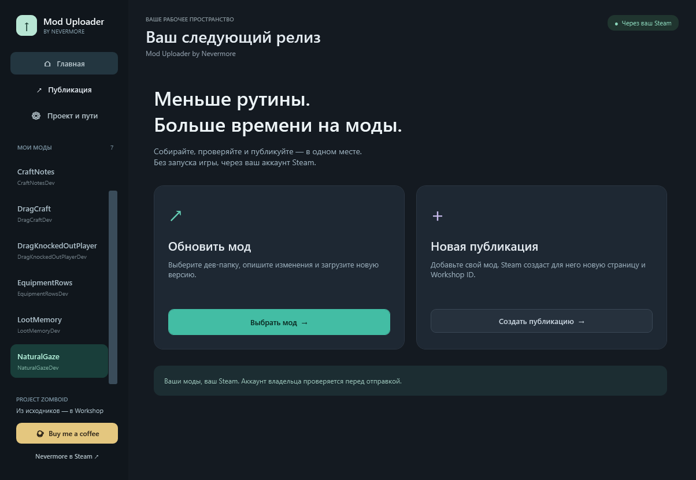

# Mod Uploader by Nevermore

A standalone Windows tool for publishing **Project Zomboid** mods to Steam Workshop without launching the game.

## Download

Open this repository's **Releases** page and download `ModUploader.exe`. No installer or ZIP is required. `SHA256SUMS.txt` is provided alongside each release.

This is a **closed-source release repository**. Application source code and development history are not included. GitHub's automatically generated “Source code” downloads contain this repository's documentation, not the application source. Download the attached EXE to use the tool.

## Features

- Dark interface with a choice to update an existing mod or create a new Workshop listing.
- Formatted BBCode preview for update notes; click to edit the source text.
- Separate mod settings beside the selected mod title.
- Success confirmations with Spiffo and a green check, plus a three-second, click-dismissible publication overlay.
- English by default, with an instant English / Русский switch in Settings.
- Dev-project selection, optional preparation scripts for Java and Lua mods and file-integrity checks.
- Steam BBCode changelog editor.
- Independent description and preview toggles for existing listings. When off, those values are preserved in Steam.
- New listing title, description, preview and visibility, with private visibility by default.
- Saved Workshop IDs, progress feedback and detailed error logs.
- Uses your running Steam account and verifies ownership before updates.
- Removes missing source mods when you run Find mods, with optional local file deletion through Delete mod.
- Steam BBCode controls in both update notes and descriptions.
- Full-image Workshop previews and a separate in-game icon editor, with mod icons in the sidebar and header.
- Transparent mascot logo and matching Windows application icon.
- Internal Delete mod overlay with transparent Spiffo artwork, flickering firelight and three choices with tooltips.
- Centered animated Spiffo during preparation/publication, with progress, status, wind and a brief green-check completion screen.

## Requirements

- Windows x64 with .NET Framework 4.8 or newer.
- An installed Steam copy of Project Zomboid and the Steam client running under your own account. The game can stay closed.
- Your mod's dev files and Workshop folder. Set individual paths using the gear beside the mod title; set shared paths in **Settings**.
- PowerShell 7 when using a preparation script. Java, Python or other build tools are only needed if your chosen project's script requires them.

Choose **Settings → App language → English / Русский** to change the interface language. The choice is saved automatically, applies without restarting and keeps your drafts and publication options intact. The tool is for Project Zomboid, not a universal uploader for unrelated Steam games.

## Use

Choose **Update a mod** to select an existing project and enter a changelog. **Prepare files** only prepares the local Workshop folder; **Publish** also sends it to Steam.

Choose **New listing** to prepare a local draft from your dev folder. Fill in the listing details and use **Create and publish** to allocate a Workshop ID and upload. If Steam requests the Workshop legal agreement, accept it on the item page. If creation times out with an uncertain result, inspect your Workshop items before retrying; the tool blocks blind duplicate creation.

The description/preview switches apply to updates of existing items. A new listing requires these fields. Avoid editing payload files while publishing.

**Find mods** removes entries whose source folder or `mod.info` is missing. **Delete mod** lets you remove only the app entry, delete the Workshop folder, or delete Workshop plus the mod's source files. File deletion requires a second confirmation showing the exact folders. It does not remove the Steam listing or the surrounding dev repository. Use **+ Dev folder** to restore an entry you removed from the app.

Click the Workshop preview to see the full image. Under **In-game icon**, choose the mod version (`mod.info`), select a PNG and click **Apply to source files**. The source icon is saved separately from the Workshop preview and will be included when you next prepare/publish. Mods without an icon display a placeholder.

Both editors have a **More** menu for headings, lists, quote, code, spoiler, divider, images, tables and embeds, plus [Steam's formatting reference](https://steamcommunity.com/comment/WorkshopItem/formattinghelp). Steam controls which tags render on each text surface.

## Signature and local data

The EXE is Authenticode-signed with a **self-signed Nevermore certificate** and a timestamp. This provides a verifiable signature under that key; it is not a publicly trusted publisher certificate. Windows/SmartScreen warnings may still appear. No certificate installation or changes to Windows trust settings are required by this tool.

No Steam credentials or signing private keys are embedded in the EXE. Settings and logs are stored under `%LOCALAPPDATA%/WorkshopPublisher`. Mod signing keys remain part of each author's own build setup. Branding and support links do not restrict uploads to the tool author's account.

## Status

Offline checks, UI state checks, cryptographic signature verification and read-only Steam connectivity have passed. Actual Steam item creation and update were not exercised during automated validation.

## Author and support

[Nevermore on Steam](https://steamcommunity.com/profiles/76561198179591723/) · [Buy Me a Coffee](https://buymeacoffee.com/nnevermore)
