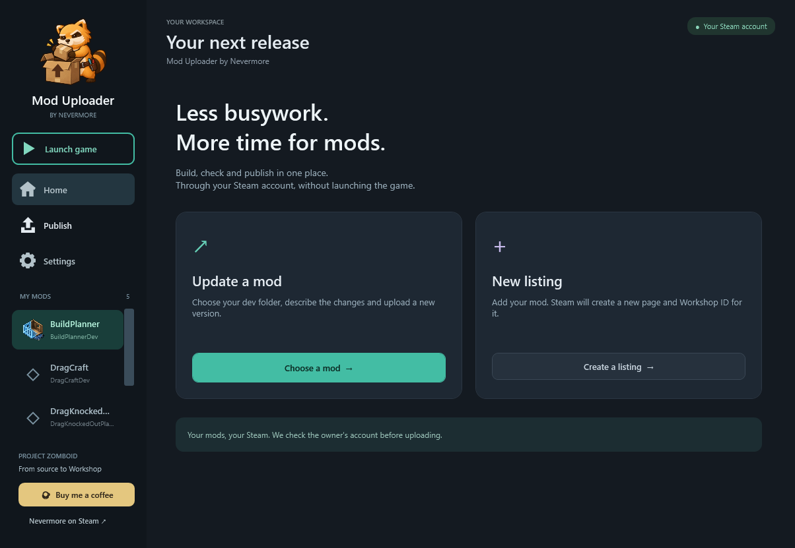
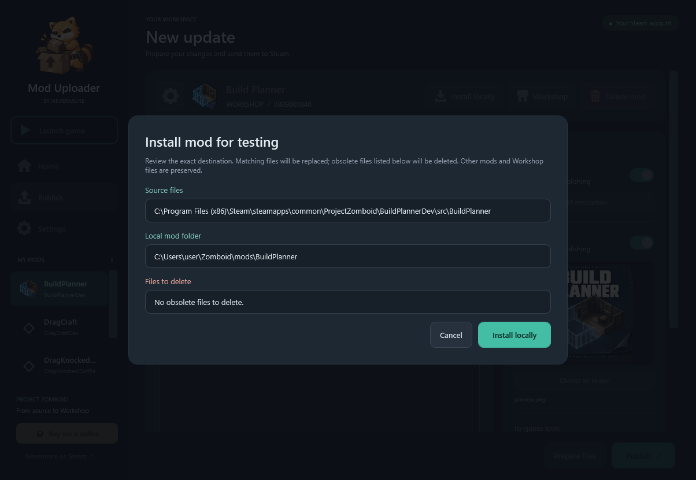

# Mod Uploader by Nevermore

**Prepare, test and publish your Project Zomboid mods from one Windows app.**

Mod Uploader copies your prepared mod files into a Workshop upload folder, lets you write update notes and sends updates through your running Steam account. You can also install a local copy for testing and launch Project Zomboid through Steam. Publishing itself does not require launching the game.

[Download from Releases](https://github.com/NNevermore123/ModUploader/releases) · [What's new](CHANGELOG.md) · [1.0.9 release notes](release-notes/v1.0.9.md)


## Download and requirements

1. Open [Releases](https://github.com/NNevermore123/ModUploader/releases) and download the attached **ModUploader.exe**.
2. Keep **SHA256SUMS.txt** if you want to verify the download. **RELEASE_NOTES.md** describes that version.
3. Run the EXE. There is no installer, ZIP or separate application asset folder.

You need **Windows x64**, **.NET Framework 4.8 or newer**, an installed Steam copy of **Project Zomboid**, and Steam running under the account that owns the Workshop item. The app uses the game's installed Steam API library; no Steam API DLL is included in the download.

**PowerShell 7 is needed only when you configure a preparation script.** Java or other build tools are needed only if your mod's build process requires them. Leaving the script field empty uploads files you have already prepared; the app does not compile or sign your mod automatically.

This repository contains product documentation and releases. GitHub's **Source code** ZIP/tar.gz downloads contain documentation, not the application. Download the attached EXE to use the tool.

## First setup



1. Open **Settings**. Check the Project Zomboid installation folder, development search folder and Workshop folder. Save the paths.
2. Use **Find mods** to discover projects named `*Dev` inside the development search folder. Or use **+ Dev folder** to add one project directly.
3. Select your mod and click the **gear beside its icon**. Check its repository folder, source folder, Workshop folder and optional `.ps1` preparation script. Save these mod settings.

For discovery, keep each mod's ready-to-copy files inside `src/<ModFolder>`:

```text
MyModDev/
  src/
    MyMod/
      ... your mod files, including mod.info ...
  Prepare-MyMod.ps1    (optional)
```

`mod.info` may be inside the appropriate game-version folder. Select the complete mod payload folder as **Source files**, rather than the whole development repository. The repository contains your development files; Source contains the files the game and Workshop should receive.

For an **existing publication**, select its Workshop folder containing `workshop.txt`, `Contents/mods` and, when used, `preview.png`. Its `workshop.txt` must identify the existing Workshop item. For a **new publication**, use the New listing workflow below to create a local draft.

English is the default language. **Settings → App language → English / Русский** switches instantly and saves your preference. Your notes, descriptions, paths and publication options stay intact.

## Which button should I use?

| Action | What it does | Sends files to Steam? |
|---|---|---|
| **Prepare files** | Runs the selected preparation script, if any, then synchronizes Source into the local Workshop payload and checks file hashes. | No |
| **Install locally** | Copies the current Source into `%USERPROFILE%\Zomboid\mods\<ModFolder>` after you review the exact destination and obsolete files. | No |
| **Launch game** | Asks Steam to launch Project Zomboid so you can enable and test your mod. | No |
| **Publish** | Prepares the Workshop payload and uploads it to the selected Workshop item. | Yes |
| **Workshop** | Opens the mod's Workshop page. | No |

## Test your mod locally

1. Build or otherwise prepare your mod's **Source files** using your normal development workflow.
2. Click **Install locally** in the selected mod's header.
3. Review the source, local destination and list of files to delete, then confirm.
4. Click **Launch game**, enable the mod in Project Zomboid and test it.



Local installation copies Source as it currently exists. **It does not run the preparation script, upload to Steam or launch the game automatically.** It replaces matching files and removes the obsolete files shown in the confirmation. Obsolete backup/archive files in that local copy can be removed after this review; no new backups are created. Keep version history in your own development repository.

The local test copy and the Workshop upload folder are separate. After further edits, install again for local testing, then use Publish when you are ready to distribute the update. The Spiffo success screen closes after three seconds or when clicked.

## Update an existing Workshop item

1. Choose **Update a mod** or select your project in the sidebar.
2. Enter your update notes. Both text editors provide Steam BBCode controls; the notes preview can be clicked to edit its source.
3. Turn on **Description** or **Preview** only when you want to replace that value. Both switches are off by default for existing items, preserving those values on Steam.
4. Optionally use **Prepare files** to inspect the local payload first. Click **Publish** to prepare and upload it.
5. Wait for Steam's confirmation. If Steam requires the Workshop legal agreement, open the item page and accept it.

Updates use the Workshop ID already associated with the project. The app checks the running Steam account against the item's owner. Nevermore branding does not restrict which author's mods can be uploaded.

Do not edit payload files during preparation or publication. An explicitly configured script that is missing or fails stops the operation. Progress and the expandable log show the current phase and errors.

## Create a new Workshop listing

1. On Home, choose **New listing → Create a listing**.
2. Select your development repository, prepared Source folder and an empty Workshop destination. Continue to create a **local draft**; this does not create a Steam item yet.
3. Enter a **title**, **description**, **preview image** and **visibility**. All are required for an initial publication. Visibility defaults to **Private**.
4. Click **Create and publish**. The app obtains a Workshop ID, saves it locally and uploads the prepared payload.
5. Check the resulting Workshop page and any legal-agreement requirement before making the item public.

If item creation times out with an uncertain result, check your Steam Workshop items before trying again. The app blocks a blind retry that could create a duplicate. A saved ID is reused for subsequent uploads.

## Previews, icons and project management

- **Workshop preview** is the listing image. Click it to view the full image.
- **In-game icon** is separate: choose the source version's `mod.info`, select a PNG and click **Apply to source files**. Publish later to distribute the change.
- **Find mods** removes app entries whose source folder or `mod.info` no longer exists. A missing Workshop folder alone does not remove a valid source project.
- **Delete mod** can remove only the app entry, or also delete its local Workshop/source files. Physical deletion has a separate confirmation showing the exact paths. It does not delete the Steam listing or the surrounding development repository. Use **+ Dev folder** to add a removed entry again.

Archive files, backup files and private key material do not belong in Source. Java JAR payloads require their accompanying `.jar.zbs` files. Mod build/signing remains part of your own development workflow.

## Local data and Windows signature

Settings and the latest operation log are stored under `%LOCALAPPDATA%\WorkshopPublisher`. Update-note drafts survive switching mods during the current session; do not rely on them being saved after closing the app. No Steam login form is required: the installed Steam session supplies the account. No Steam credentials or signing private keys are embedded in the EXE.

The EXE is Authenticode-signed with the **self-signed Nevermore certificate** and a timestamp. This does **not** establish public Windows trust or remove SmartScreen warnings. The app does not require importing a certificate or changing Windows trust settings.

To compare your download with the release checksum, run this in the folder containing the downloaded files:

```powershell
Get-FileHash .\ModUploader.exe -Algorithm SHA256
Get-Content .\SHA256SUMS.txt
```

The EXE's hash must match the value beside `ModUploader.exe` in `SHA256SUMS.txt`.

## Validation and support

Release preparation checks offline behavior, UI states, local-copy fixtures and the signed EXE's cryptographic integrity. Screenshots show the English interface. Automated checks do not perform real Steam publication or prove your mod works in gameplay or multiplayer; test those separately.

[Nevermore on Steam](https://steamcommunity.com/profiles/76561198179591723/) · [Buy Me a Coffee](https://buymeacoffee.com/nnevermore)
